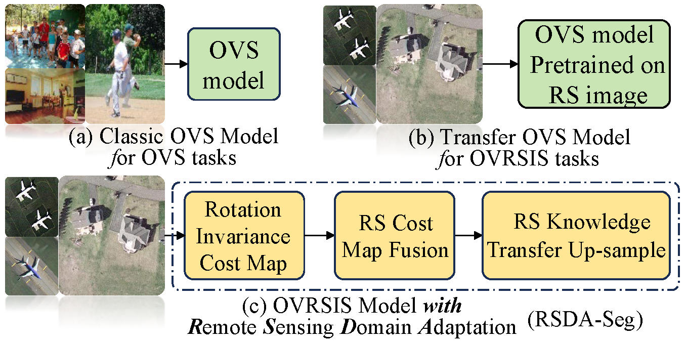
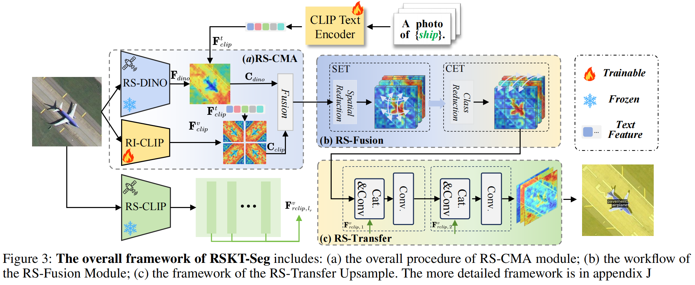
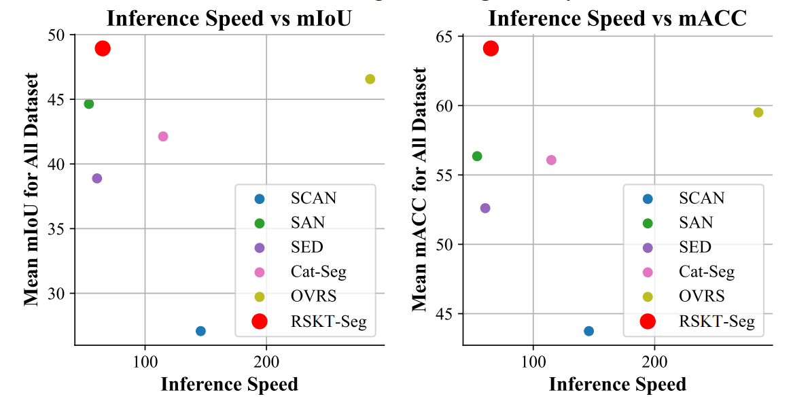
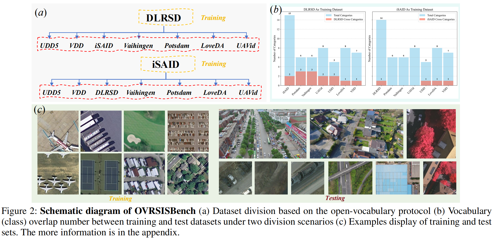

# Exploring Efficient Open-Vocabulary Segmentation in the Remote Sensing

> **Note**  
> The author sincerely invites you to contribute to this repository so that we can further improve our open-source work together.  
> If you encounter any questions, please feel free to open an issue on GitHub or contact me directly via email at [my email](mailto:libingyu0205@mail.ustc.edu.cn)       (libingyu0205@mail.ustc.edu.cn).

## 🚀 Updates​
- [x] 2025/9/12: init repository.

## 🚩 TO DO​
- [ ] release the trained weight.
- [ ] submit the open-sourced dataset in huggingface. (already in Baidu Netdisk [OVSISBench](https://pan.baidu.com/s/1eXPwAbXRIecuy0-ZR6u0-Q?pwd=USTC) )


[paper](https://arxiv.org/pdf/2509.12040.pdf)

[Open-soured Datasets](https://pan.baidu.com/s/1eXPwAbXRIecuy0-ZR6u0-Q?pwd=USTC)
## Introduction
Open-Vocabulary Remote Sensing Image Segmentation (OVRSIS), an emerging task that adapts Open-Vocabulary Segmentation (OVS) to the remote sensing (RS) domain, remains underexplored due to the absence of a unified evaluation benchmark and the domain gap between natural and RS images.
To bridge these gaps, we first establish a standardized OVRSIS benchmark (**OVRSISBench**) based on widely-used RS segmentation datasets, enabling consistent evaluation across methods. Using this benchmark, we comprehensively evaluate several representative OVS/OVRSIS models and reveal their limitations when directly applied to remote sensing scenarios.
Building on these insights, we propose **RSKT-Seg**, a novel open-vocabulary segmentation framework tailored for remote sensing. RSKT-Seg integrates three key components: (1) a Multi-Directional Cost Map Aggregation (RS-CMA) module that captures rotation-invariant visual cues by computing vision-language cosine similarities across multiple directions; (2) an Efficient Cost Map Fusion (RS-Fusion) transformer, which jointly models spatial and semantic dependencies with a lightweight dimensionality reduction strategy; and (3) a Remote Sensing Knowledge Transfer (RS-Transfer) module that injects pre-trained knowledge and facilitates domain adaptation via enhanced upsampling.
Extensive experiments on the benchmark show that RSKT-Seg consistently outperforms strong OVS baselines by +3.8 mIoU and +5.9 mACC, while achieving 2× faster inference through efficient aggregation. Our anonymous code is in the appendix. 

### 🌟 New Task: Open-Vocabulary Remote Sensing Semantic Segmantation (OVRSIS)

- OVRSIS aims at segmenting ```arbitrary``` semantic class in remote sensing domain. 
- OVRSIS methods need ```no finetuning``` adapting to ```new classes```.

### 🌟 New Approach: RSKT-Seg (Remote Sensing Image Segmentation with Domain Adaptation)

- We propose RSKT-seg, a novel framework for open-vocabulary segmentation in remote sensing with Domain Adaptation.
- A multi-direction remote sensing cost map aggregation (RS-CMA) framework is designed, which is capable of accurately capturing rotation-invariant features in remote sensing images.
- An efficient cost map aggregation method (RS-Fusion) is presented which enables faster training and inference speeds without sacrificing accuracy.
- Remote Sensing Knowledge Transfer (RS-Transfer) module is introduced to enable effective model transfer to the remote sensing domain.

### 🌟 Great Performance: More Accurate and Faster Inference Speed with fewer trainable parameters


| Method | train time(ms/iteration) | total param.(M) | trainable param(M) |
| ---- | ---- | ---- | ---- |
| SED | 8.60 | 180.76 | 89.59 |
| Cat-Seg | 9.60 | **154.29** | 127.55 |
| OVRS | 18.53 | 154.32 | 127.57 |
| RSKT-Seg | **7.96** | 196.15 | **29.89** | 

## Prepare *open-sourced* datasets
We have expanded the existing dataset from before to form a more comprehensive dataset evaluation.


### Download Datasets: 
Download DLRSD, iSAID, Potsdam, Vaihingen, LoveDA, UAVid, UDD5, VDD from [OVSISBench](https://pan.baidu.com/s/1eXPwAbXRIecuy0-ZR6u0-Q?pwd=USTC) with password: **USTC**

- Download *open-sourced* Datasets.
- Put it into ```./datasets```

## Installation
An example of installation is shown below:
```
conda create -n RSKT-Seg python=3.8
conda activate RSKT-Seg
conda install pytorch==2.3.0 torchvision==0.18.0 torchaudio==2.3.0 pytorch-cuda=11.8 -c pytorch -c nvidia
pip install -r requirements.txt
```
- Linux with Python ≥ 3.8 required
- Ensure that the versions of PyTorch, TorchVision, and Detectron2 are compatible. For more information, refer to [pytorch.org](https://pytorch.org) and the  [Detectron2 install guide](https://detectron2.readthedocs.io/tutorials/install.html).


## Prepare *open-sourced* pretrained .pth file
### Prepare CLIP ViT encoder pretrained file
- Download *open-sourced* [ViT-B/32](https://openaipublic.azureedge.net/clip/models/40d365715913c9da98579312b702a82c18be219cc2a73407c4526f58eba950af/ViT-B-32.pt) for remoteclip initialization. 
- Download *open-sourced* [ViT-B/16](https://openaipublic.azureedge.net/clip/models/5806e77cd80f8b59890b7e101eabd078d9fb84e6937f9e85e4ecb61988df416f/ViT-B-16.pt) for CLIP encoder base.
- Download *open-sourced* [ViT-L/14@336px](https://openaipublic.azureedge.net/clip/models/3035c92b350959924f9f00213499208652fc7ea050643e8b385c2dac08641f02/ViT-L-14-336px.pt) for CLIP encoder large.

And you can put it in the ```./pretrain``` and modify the ```RSKT_Seg\third_party\clip.py```.

    pretrained = {
    "ViT-B/32": "./pretrained/ViT-B-32.pt",
    "ViT-B/16": "./pretrained/ViT-B-16.pt",
    "ViT-L/14@336px": "./pretrained/ViT-L-14-336px.pt",
    }

to the path to the pretrain.

### Prepare DINO ViT encoder pretrained file
- Download *open-sourced* [DINO](https://drive.google.com/file/d/1kH0wDM_Hl4sEQJG8JjILCo0RTx65X7zV/view)
- Put it into the ```./pretrain```, and change the ```DINO_WEIGHTS``` in ```./configs```.

### Prepare RemoteCLIP ViT encoder pretrained file
- Download *open-sourced* [RemoteCLIP-ViT-B-32.pt](https://huggingface.co/chendelong/RemoteCLIP/tree/main)

- Put it into the ```./pretrain```, and change the ```CLIP_PRETRAINED_WEIGHTS_REMOTE``` in ```./configs```.

## Training and Evaluation
- Using the ```KEY.sh``` for Training and Evaluation

## Visualization
- Using the ```KEY_vis.sh``` for Visualization

- For the Cost Map Visualization please use ```RSKT_Seg\visualize_corr.py```.

## Acknowledgement
We sincerely appreciate the invaluable contributions of numerous open-source projects and datasets that have supported our work, including but not limited to [DETECTRON2](https://github.com/facebookresearch/detectron2), [CAT-SEG](https://github.com/cvlab-kaist/CAT-Seg), [SAMRS](https://github.com/ViTAE-Transformer/SAMRS), [GSNET](https://github.com/yecy749/GSNet), [LoveDA](https://github.com/Junjue-Wang/LoveDA](https://github.com/yecy749/GSNet?tab=readme-ov-file)), [OVRS](https://github.com/caoql98/OVRS))

## Star History

[](https://www.star-history.com/#LiBingyu01/RSKT-Seg&Date)
